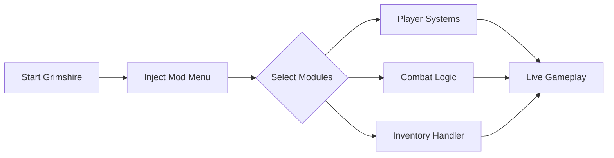

## 🌫️ A Quiet Door Opens in Grimshire

There is a certain hush to **Grimshire**—a world where the fog listens, where every footstep is a decision. The *Grimshire Mod Menu* arrives not as thunder, but as a key. A small, precise tool that turns friction into flow, uncertainty into choice.

This README is a lantern-lit walk through the software: what it does, how it breathes with the game, and why so many players choose control without chaos.

---

## 🧭 Overview: What Is the Grimshire Mod Menu?

The **Grimshire Mod Menu** is a lightweight Windows-based modification tool designed to enhance survival gameplay through configurable systems. It does not rewrite the world—it *reveals its levers*. From resource tuning to combat balance and movement freedom, the menu offers modular control you can toggle at will.

Built for stability and restraint, it prioritizes:

* Selective activation (use only what you need)
* Performance-safe hooks
* Clear, reversible settings

Think of it as a craftsman’s bench rather than a sledgehammer.

---

## 🧩 Feature Set (Modular by Design)

Each module is optional, adjustable, and meant to coexist peacefully with the rest of your setup.

### 🛡 Survival & Player Control

* God Mode toggle (full or conditional)
* Infinite stamina with fatigue simulation
* Health regen scaling (slow, natural curves)
* Hunger & thirst stabilization 🍃

### ⚔ Combat & Encounter Tweaks

* Damage multiplier (player & enemies)
* One-hit mode (optional, PvE-focused)
* Enemy aggression radius control
* Knockback and stagger tuning

### 🎒 Inventory & Resources

* Infinite items (stack-based, safe mode)
* Weight limit removal
* Crafting without material loss
* Instant build placement

### 🧭 Movement & Exploration

* Speed multiplier (walk/run/sprint)
* No-clip / ghost mode
* Jump height control
* Fall damage disable

### ⚙ Menu & Configuration System

* In-game UI with live toggles
* Hotkey binding for every feature
* Save/load multiple profiles
* Reset-to-default safety switch

> [!IMPORTANT]
> All values use soft scaling by default. Extreme settings are available but intentionally hidden behind advanced toggles to reduce instability.

---

## ⚡ Setup & First Launch

Installation is calm and uncomplicated—no labyrinths, no rituals beyond the obvious.

1. Launch **Grimshire** and load into a save
2. Run the Mod Menu loader as Administrator
3. Wait for injection confirmation
4. Press the menu hotkey to begin

```text
Open Menu: INSERT
Toggle God Mode: F1
Toggle Speed: F2
Emergency Disable: END
```

> [!NOTE]
> The menu remembers your last profile automatically. Each save file can retain its own configuration.

---

## 🧠 How the Mod Menu Works (System Flow)



Inactive modules remain dormant, ensuring the game loop stays smooth and predictable.

---

## ❓ Frequently Asked Questions

### Is the Grimshire Mod Menu safe to use?

For single-player and offline use, yes. The tool avoids destructive memory edits and favors reversible hooks.

### Will it break my save file?

Highly unlikely. Most changes are runtime-only. Still, backups are always a wise companion.

### Can I use just one feature?

Absolutely. Each module is independent—activate one, many, or none.

### Does it affect performance?

Negligible impact. The menu is optimized to sleep when idle.

### Are updates frequent?

Yes. Minor game patches usually require no action; larger updates are followed by quick compatibility fixes.

---

## 🌒 Why Players Choose This Mod Menu

Because sometimes survival games are not about suffering endlessly—they’re about *shaping the experience*. Testing builds. Exploring without friction. Learning systems without punishment.

The **Grimshire Mod Menu** respects the mood of the game. It does not shout over it. It simply hands you the dials.

---

## 🌟 Final Thoughts

Grimshire is a place of shadows and patience. This mod menu does not remove that—it lets you decide *how much* of it you want today.

Slow evenings of exploration. Fast experiments with combat balance. Gentle forgiveness after a mistake. Control, quietly earned.

---
